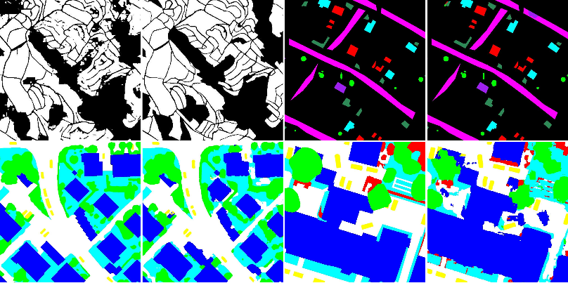

# Dynamic Multi-Context Segmentation of Remote Sensing Images based on Convolutional Networks

<p align="center">
<figure>
  
  <figcaption>Figure 1. Examples of results obtained in this work.</figcaption>
</figure> 
</p>

Semantic segmentation requires methods capable of learning high-level features while dealing with a large volume of data. Towards such goal, Convolutional Networks can learn specific and adaptable features based on the data. However, these networks are not capable of processing a whole remote sensing image, given its huge size. To overcome such limitation, the image is processed using fixed size patches. The definition of the input patch size is usually performed empirically (evaluating several sizes) or imposed (by network constraint). Both strategies suffer from drawbacks and could not lead to the best patch size. To alleviate this problem, several works exploited multi-context information by combining networks or layers. This process increases the number of parameters resulting in a more difficult model to train. In this work, we propose a novel technique to perform semantic segmentation of remote sensing images that exploits a multi-context paradigm without increasing the number of parameters while defining, in training time, the best patch size. The main idea is to train a dilated network with distinct patch sizes, allowing it to capture multi-context characteristics from heterogeneous contexts. While processing these varying patches, the network provides a score for each patch size, helping in the definition of the best size for the current scenario. A systematic evaluation of the proposed algorithm is conducted using four high-resolution remote sensing datasets with very distinct properties. Our results show that the proposed algorithm provides improvements in pixelwise classification accuracy when compared to state-of-the-art methods.

### Usage

Each Python code has a usage briefly explaining how to use the code.
In general, the required parameters have intuitive names.
For instance, to call the code responsible to classify the ISPRS datasets, one can call:

```python isprs_dilated_random.py.py input_path output_path trainingInstances testing_instances learningRate weight_decay batch_size niter reference_crop_size net_type distribution_type probValues update_type process```

where,

1. `input_path`is the path for the dataset images.
2.  `output_path` is the path to save models, images, graphs, etc.
3. `trainingInstances` represent the instances that should be used to train the model (ex.: 1,3,5,7).
4. `testing_instances` represent the instances that will be used to validate/test the algorithm (same logic as above).
5. `learningRate` corresponds to the learning rate used in the Stochastic Gradient Descent.
6. `weight_decay` represents the weight decay used to regularize the learning.
7. `batch_size` is the size of the batch.
8. `niter` is the number of iterations of the algorithm (used related to the epoch).
9. `reference_crop_size` is the size used as reference (only used for internal estimation).
10. `net_type` is the flag to identify which network should be trained.
There are several options, including:
	1. `dilated_grsl`, which in the paper has name Dilated6Pooling,
	2. `dilated_icpr_original`, that is actually Dilated6 network,
	3. `dilated_icpr_rate6_densely`, which is the DenseDilated6 network in the paper, and
	4. `dilated_grsl_rate8`, that is presented as Dilated8Pooling in the paper.
11. `distribution_type` represents the probability distribution that should be used to select the values.
There are four options:
	1. `single_fixed`, which uses one patch size during the whole training,
	2. `multi_fixed`, which is presented in the manuscript as Uniform Fixed,
	3. `uniform`, the Uniform distribution, and
	4. `multinomial`, the Multinomial distribution.
13. `probValues` represents the values of patch size that will be used (together with the distribution) during the processing.
14. `update_type` which represents how the update of the patch sizes should be performed (options are `acc` and `loss` for accuracy and loss, respectively). 
15. `process` which is the operation that will be performed.


### Datasets

Four datasets were used in this work:
1. Coffee dataset, composed multispectral high-resolution scenes of coffee crops and non-coffee areas.
Unfortunately, this dataset has not yet been released for the public.
2. GRSS Data Fusion dataset, consisting of very high-resolution of visible spectrum images.
This dataset was publicly released in the [2014 GRSS Data Fusion Contest](http://www.grss-ieee.org/community/technical-committees/data-fusion/2014-ieee-grss-data-fusion-contest/).
3. Vaihingen dataset, composed of multispectral high-resolution images and normalized Digital Surface Model, and
4. Potsdam dataset, also composed of multispectral high-resolution images and normalized Digital Surface Model.
The last two datasets are publicly available [here](http://www2.isprs.org/commissions/comm3/wg4/results.html).


### Citing

If you use this code in your research, please consider citing:

    @article{nogueiraTGRS2019dynamic,
        author = {Keiller Nogueira and Mauro Dalla Mura and Jocelyn Chanussot and William Robson Schwartz and Jefersson A. dos Santos}
        title = {Dynamic Multi-Context Segmentation of Remote Sensing Images based on Convolutional Networks},
        journal = {{IEEE} Transactions on Geoscience and Remote Sensing},
        year = {2019},
        publisher={IEEE}
    }
